Active Directory Lab 

Environment Overview 

Domain Controller: Windows Server 2022  

Clients: 2× Windows 11 Enterprise  

Firewall: OPNsense  

Network: 10.0.0.0/24 (Internal)  

Domain: quik.local  

Virtualization: (VMware / VirtualBox / Hyper-V) 

 

 

1. Creating Windows Server as a Domain Controller  

Confirmation that domain has been created 

2. Created OUs to separate users and computers by region and function, improving Group Policy targeting and administrative organization. 

In this example, I will be creating only one OU, but if your organization's had users outside of the USA such as Asia or Europe - You would add these as well 

 

 

Within the USA OU, I have created a Computer and Users OU.  
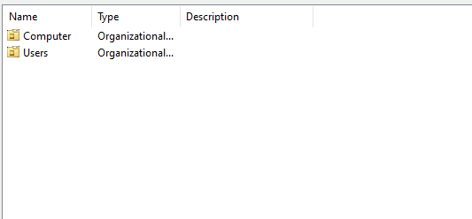
 

Within Users OU, I have created an IT Security and Distribution list group as well as two users.  

 

 

 

 

3. Creating Group Policies 

Password Policy - I created a new GPO and added it to the domain under Password Policy 

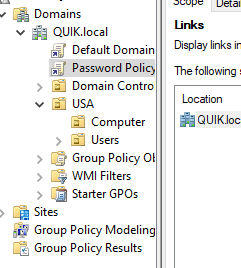

 

From there, I edited the Password Policy and changed the minimum password length to 8 characters and left everyting else as default 

Added another GPO under Drive Mapping - Editing under User configuration - Preferences 

Adding Desktop Wallpaper policy - User configuration - Policies 

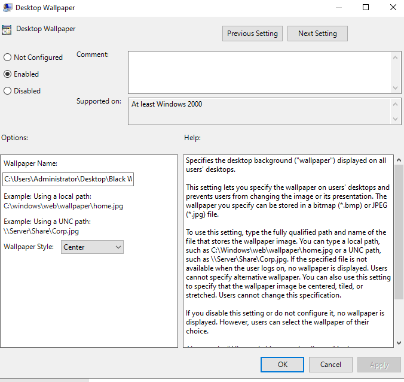

 

4. Setting up DHCP on Windows Server 2022 

 Opened Win + r - ncpa.cpl - Navigate to IPv4 Properties 

Set IP address and DNS server Server for 10.0.0.10 

5. Configuring DHCP for AD server 

I installed the tool for DHCP within Server Manager and set the Scope 

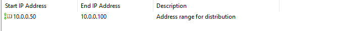
 

6.  Connecting Windows 11 Clients via DHCP 

I set the Windows 11 client Ethernet adapters for DHCP, confirmed it received a valid IP address 
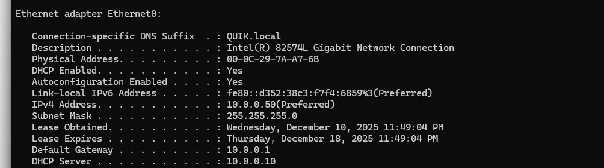
 
I repeated these steps for the other Windows client as well. 

7. Joining Users to Domain  

I spun up two Windows 11 Enterprise VMs. The next step was to join the two Windows 11 VMs to the domain. To do so, I gathered the IP address of the DC:  
 
Going back into the Windows VMs - I set the DNS for Ethernet 0 to match the IPv4 address of the DC. After Setting DNS to match, I added both Computers to the Quik.local Domain and entered the correct credentials for users: Steve Rogers and Peter Parker. 
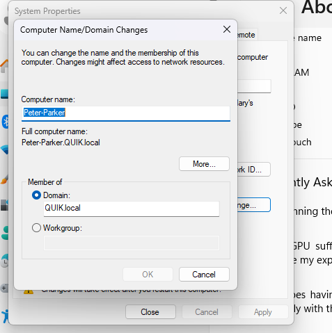

 

Confirmation that the computers have joined the domain correctly 

 
 

 

I went back into the DC and moved the computers under the USA users OU to ensure better organizational structure. After, I applied the necessary GPOs necessary to both users and computers of the USA OU.     
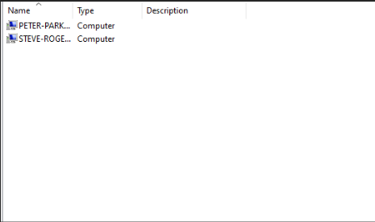

I ran gpupdate /force on both Windows 11 computers and Restarted the PC. I confirmed that the GPO of Password Length is in effect. 

 

 

2.Adding Active Directory Certificate Services (Setting up a Certificate Authority) 
 

Adding Roles and Features - Add AD Certificate Services 

 

 
5. Configuring a Firewall - OpnSense Firewall 

OPNsense needs two NICs  

NIC 1 = WAN (NAT) 

NIC 2 = Lan (Host-Only) 

 

After, I configured the LAN IPv4 Address to 10.0.0.1/24 
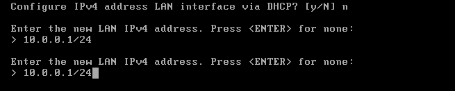

I set up the Lan IP address as well as WAN for DHCP 
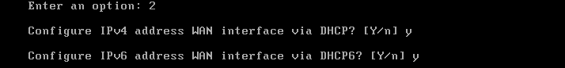
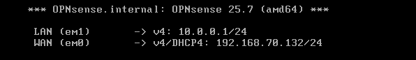
 

After confirming these settings, I navigated to the AD server and set the IPv4 address of the server in the same subnet as the Firewall. I can now access the web gui through IP 10.0.0.1 
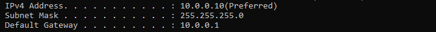
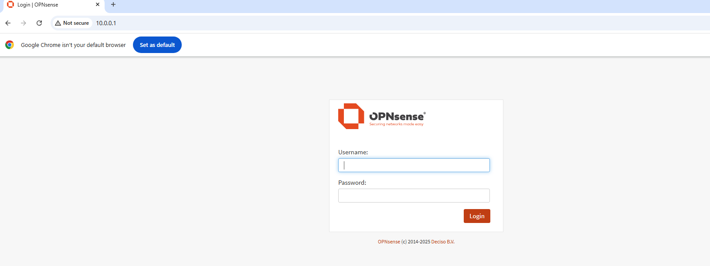
 

I pointed the Router to OpnSense Firewall and DNS server is the AD server IPv4 address 

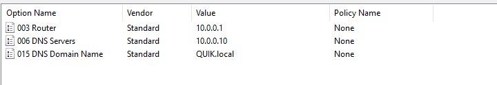

 

 
